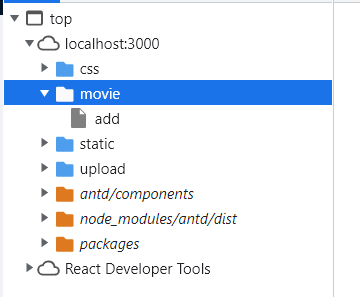
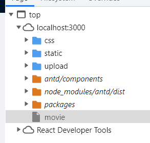

# 项目开发过程全记录

1. 新建movies文件夹，作为项目目录
2. 在movies文件夹下，使用```git init```初始化本地仓库
3. 新建```.gitignore```文件，添加需要在推送时忽略的文件
4. 新建server、client文件夹，用于存放服务器端、客户端的代码

- 服务端开发

server目录下：

1. run ```yarn init -y```初始化项目，生成```package.json```文件
2. run ```tsc --init```, 创建 ```tsconfig.json``` 文件, 初步配置好该文件
3. 为了能在node环境下，ts使用console等库函数，需要增加类型库 ```yarn add -D @types/node```
4. 安装代码风格检查库tslint：```yarn add -D tslint typescript```,该库依赖于typescript
5. ```npx tslint --init```,生成```tslint.json```配置文件(遇到报错，将node版本切到14.14.0解决)
6. 安装vscode中的```tslint```插件，但是该插件已被弃用，配置了tslint文件后，还需手动启用本地库(必须使用项目安装的typescript，而不是全局安装的)，```ctrl+shift+p```选择TSLINT:manage，然后enableing...
7. 新建```entities```目录，存放实体；安装```class-validator, class-transformer```用来验证数据
8. 安装```reflect-metadata```
9. 安装mongodb数据库，数据库驱动选择```mongoose```, 安装```mongoose```
10. 定义一个Schema，Mongoose 的一切始于 Schema。每个 schema 都会映射到一个 MongoDB collection，并定义这个collection里的文档的构成。然后把 schema 转换为一个 Model并导出，使用 mongoose.model(modelName, schema) 函数。
11. 连接mongoDB数据库
12. 创建```services```文件夹，利用Model，提供数据库服务。(增删查改)
13. 安装```express```，使用```express```实现接口访问控制功能。
    1. 普通get/post/put/delete请求
    2. 文件上传的post请求 (form-data), 安装```multer```处理文件上传

- 客户端开发

1. 把之前的client文件夹删除，使用```create-react-app```脚手架，自动生成client文件夹；
   1. run ```create-react-app client --template typescript```
2. 开发客户端的api请求功能，安装```axios```, 该包对node版本有要求。
3. 使用redux管理表格数据，创建action和reducer
4. 仓库改造，使用redux toolkit来管理reducer，actions
   1. 遇到的问题： 使用createAsyncThunk创建异步任务，由于我需要在payloadcreator中使用getState，因此需要声明泛型的类型，将state声明为IMoviState时，在外面使用dispath分发该任务时，会报错。发现dispatch定义了泛型为CombinedState<{movie: IMovieState;}，而我自定义的state仅仅为IMovieState；出现赋值冲突。
   2. 解决方案：1. 在dispatch中将该函数的调用使用类型断言为any 2. 将自定义state更改为和dispatch中state一致的类型

    ```ts
    // 报错原因 dispatch中泛型 state为CombinedState<{movie: IMovieState;}
        (alias) useAppDispatch(): ThunkDispatch<CombinedState<{
            movie: IMovieState;
        }>, undefined, AnyAction> & Dispatch<AnyAction>

    // 这里 dispatch里会报错
        <button onClick={()=>dispatch(fetchMovies({
            page: 2
        }))}>movies</button>

    /**
     * 根据条件从服务器获取电影数据
     */
    export const fetchMovies = createAsyncThunk<
        void, // payload cteator返回类型
        ISearchCondtion, // payload cteator第一个参数类型
        { // thunkApi中需要用到的方法的类型
            state: {movie: IMovieState} // 这里必须设置为整个仓库的状态，设置为IMovieState时，外面dispatch会报错
        }
    >(
        "movie/fetchMovies",
        async (condition, thunkAPI) => { // payload cteator
            // ....
            thunkAPI.getState().movie // IMovieState
        }
    )
    ```

5. 路由功能开发
   1. 界面开发: 简单定义好几个需要的页面
   2. 安装路由: ```yarn add react-router react-router-dom```, 安装类型声明库```yarn add -D @types/react-router @types/react-router-dom```
6. 界面开发：使用 antd UI库
   1. 表格组件的开发
   2. 图片上传组件的开发
      - 遇到的问题及解决方案
      - 不显示预览、删除图标：设置filelist属性；upload组件会根据filelist中的url进行图片显示
      - 图片上传时，发现onChange只调用了一次，状态是uploading：使用另一个属性customRequest, 自定义上传，覆盖默认的上传行为。
   3. Form表单组件的开发
       1. 遇到的问题及解决方案
       - 在表单组件的Item中使用自定义的上传图片组件，发现上传后不显示：将上传图片组件中的imgUrl属性修改为value属性，因为表单组件默认会将value属性注入到内嵌的组件中。表单组件内部会控制value和onChange。同样的情况还有Switch组件，需要给Item设置```valuePropName="checked"```,  因为表单组件默认将你的prop注入到value属性中。
       - 我想要实现点击编辑电影，跳转后Form组件中自动补全movie的信息。因此我给Form设置初始值```initialValues={this.props.movie}```, 该属性来自父组件的状态，在父组件中请求到movie数据作为属性传给Form。然而在父组件更新状态movie后，该Form组件的initialValues并未改变。**原因是**：父组件在useEffect中改变movie状态，而**useEffect是在UI渲染后调用**，对于子组件Form中的属性initialValues只会在初次渲染时初始化，而初次渲染时父组件的movie状态还是undefined。
        **解决方案：** 使用ref转发，父组件通过ref.current拿到Form实例，再在useEffect中利用Form组件的setFieldsValue方法手动更新数据。需要注意整个过程中类型声明的问题。

        ```ts
        // MovieForm 组件我之前定义为了类组件，由于forwardRef参数只能时函数组件，因此对其进行一层包装
        // 传递navigate函数，用于路由跳转
        // ref转发
        // 这里的泛型声明，第一个是ref的类型，第二个是props的类型
        // ref的类型即我们使用formRef.current的数据类型，即Form.useForm()返回的类型FormInstance
        const MovieFormWrapper = React.forwardRef<FormInstance, IFormProp>((props, ref)=>{
            return <MovieForm {...props} ref1={ref} navigate={useNavigate()}/>
        })
        // 将ref1绑定到Form组件的ref
        <Form 
            ref={this.props.ref1}
        ...
        />

        // 对于属性props，增加ref的声明
        interface IFormProp {
            ...
            /**
             * 获取Form组件
            */
            ref1?: React.ForwardedRef<FormInstance<any>>//通过将鼠标移到上面forwardRef的参数ref拿到
        }
        export default MovieFormWrapper

        // 父组件：
        const formRef = useRef<FormInstance>(null); //注意这里必须赋null,不赋值默认T | undefined，而子组件中ref默认是T | null

        // 绑定给组件
        <MovieForm ref={formRef}/>
        // 在副作用中改变values
        // 副作用函数 完成异步请求 得到电影数据
        useEffect(() => {
            const fetchMovie = async() => {
            return await MovieService.getMovieById(id!);
            }
            fetchMovie().then(resp => {
            if(resp?.data) {
                // setState不会触发Form组件的intialValues改变
                // 因此使用ref手动更改form数据
                const form = formRef.current;
                form?.setFieldsValue(resp.data);
            }
            })
        }, [id])               
        ```
   4. 增加热映电影列表的获取 (服务端movieRoute中要将其放到首位，因为访问路径是/api/movie/hotMovie, 放到后面，会被前面/api/movie/:id匹配到)
   5. 导航栏绑定pathname(导航栏根据pathname选中当前Menu.Item)
7. 项目打包
   1. ```cd client```, run ```npm run build```, 得到打包文件夹```build```
   2. ```cd server```, run ```npm run build```, 得到打包文件夹```dist```
   3. 将```build```文件夹复制到```server/public```目录
   4. ```index.ts```中增加对这部分静态资源的访问```app.use("/", Express.static("public/build")); // 访问/ , 把他映射到public/build```
   5. 测试：```cd server```, run ```npm run dev```, 打开```localhost:3000```, 发现页面空白。查找原因，发现```index.html```中引入资源的路径有误，都是```/static/...```即默认是从服务器根路径下的static查找资源引入，这是client端打包的时候默认的配置。可以在打包前在```package.json```中新增属性```"homepackage": "."```, 则打包后引入资源目录为```./static/...```,即在```index.html```目录下的static文件夹下查找资源并引入。
   6. 除此之外，还存在css失效问题，css文件位于```./static/css/XXX.css```，检查发现引入资源的路径没有问题，但是就是无法显示，将css文件夹上移一层放到与```index.html```同级的位置css就生效了。原因未知。。今天突然它又可以了。。2022-8-15
   7. 重新测试，能够访问到首页。但是此时有一个问题：若通过点击访问/movie, 能够访问，但若是刷新，此时会从服务端访问/movie,根据服务端设置的访问映射规则"/ -> /public/build", 此时会去找```/public/build/movie```, 然而我们并没有这个文件，因此会找不到。我们想要的是无论客户端访问啥，我们都返回```/public/build/index.html```，由index去渲染页面。
   8. 利用包 connect-history-api-fallback，来完成这个映射: 在设置静态资源映射之前使用这个中间件。```import history from "connect-history-api-fallback"  app.use(history());```
   9. 此时，刷新/movie依然没问题了，但是又出现了新的问题，在movie/add页面刷新时，发生了获取资源问题的问题。通过检查。发现此时资源路径如图：
    
    而movie路径下资源路径如图：
    
    刷新每个路径时，对应的路径会进行重定向，因此movie，movie/add会重定向到index.html; 而index中会去引入js、css等资源。由于我们先前的homepage配置，引入路径都变成"./xxx", 而对于此时的add而言"./"路径下什么也没有，因此会有资源找不到的问题。所以把之前配置的"./"的"."去掉就好了，直接从根路径"/xxx"引入，解决问题。
